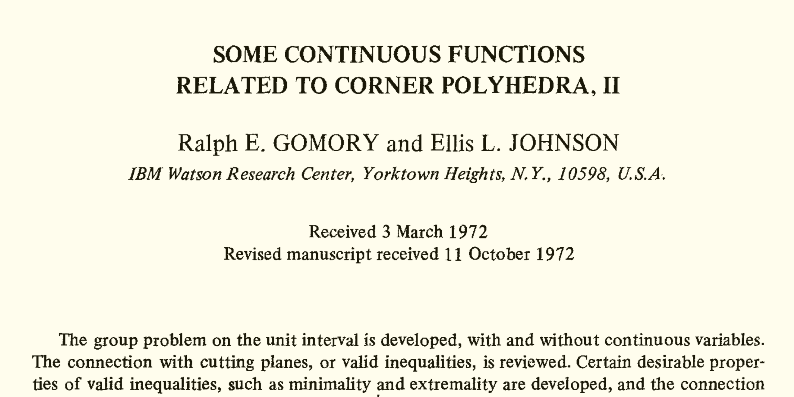

=========================================================================================================
cutgeneratingfunctionology: Python code for computation and experimentation with cut-generating functions
=========================================================================================================

.. include:: ../../README.rst
   :end-before: badges

.. toctree::
   :maxdepth: 1

   authors_thanks
   license
   how_to_run

Code for the 1-row Gomory--Johnson Infinite Group Relaxation
============================================================

.. plot::

    from cutgeneratingfunctionology.igp import *
    h = equiv7_example_xyz_2()
    g = plot_completion_diagram(h)
    g += point((2.5, 1), color='white', figsize=(8,4))
    g.set_legend_options(title="Moves closure of equiv7_example_xyz_2()")
    sphinx_plot(g)

Mathematical background:

- See the survey "Light on the Infinite Group Relaxation" 
  (http://www.optimization-online.org/DB_HTML/2014/10/4620.html)
  for the mathematical background and a table of functions in the 
  electronic compendium.

- See also the paper "An electronic compendium 
  of extreme functions for the Gomory--Johnson infinite group problem"
  (http://www.optimization-online.org/DB_HTML/2014/11/4646.html) for 
  a discussion of several functions in the compendium.

To use this module, you need to import it:: 

    import cutgeneratingfunctionology.igp as igp
    from cutgeneratingfunctionology.igp import *

.. toctree::
   :maxdepth: 1

   igp
   extreme_functions
   procedures

Code for Classical and General Dual-Feasible Functions
======================================================

.. PLOT::

    from cutgeneratingfunctionology.dff import *
    h = w_2slope_3covered()
    g = plot_2d_diagram_dff_no_lable(h, colorful=True)
    sphinx_plot(g)

To use this module, you need to import it:: 

    import cutgeneratingfunctionology.dff as dff
    from cutgeneratingfunctionology.dff import *

.. toctree::
   :maxdepth: 1

   dff

Code for Multi-Row Models
=========================

.. PLOT::

    from cutgeneratingfunctionology.multirow import *
    f = (QQ('1/2'), QQ('1/2'))
    B = Polyhedron(vertices=[(0,0),(0,2),(2,0)])
    v, g1, g2 = volume_of_lifting_region(B, f, return_plots=True)
    sphinx_plot(graphics_array([g1, g2]), figsize=(8, 3))

To use this module, you need to import it:: 

    import cutgeneratingfunctionology.multirow as multirow
    from cutgeneratingfunctionology.multirow import *

.. toctree::
   :maxdepth: 1

   multirow

Bibliography
============

.. toctree::
   :maxdepth: 1

   zzz_bib

Indices and Tables
==================

.. image:: kzh_crazy_table_head.png
   :width: 100%
   :alt:   Decorative table head from the paper "Facets, weak facets, and extreme functions of the Gomory–Johnson infinite group problem"

* :ref:`genindex`
* :ref:`modindex`
* :ref:`search`
